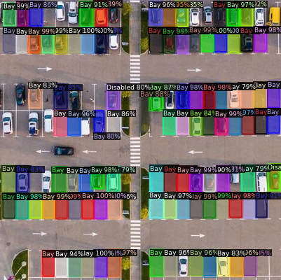
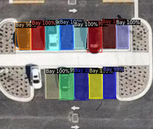
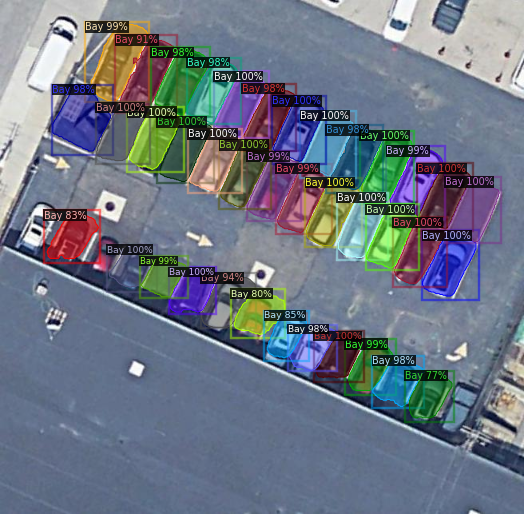

# parking_bays_detectron2
Detecting parking bays from satellite imagery

# Output

# `detectron2_website`

This is the main folder to run detectron2 from. 

We've been running it from google colab: 

- [Synthetic and Real Data Data](https://colab.research.google.com/drive/1AA-dqc8vWbf79vvcHabckPpm2eA9hJ61?usp=sharing)

- [Real data only](https://colab.research.google.com/drive/1wZchs-5UVhhDe7keXipalDe-yB6U9hyo?usp=sharing)

## Running in Docker

In the `container` folder there are a few shell scripts to make it easy to run in docker. 

See `docker_build_run_see_logs.sh` and `docker_build_run_see_stats.sh`. It will stop all containers, remove any unwanted images and run on port 8080. 

The docker container runs in flask and should open up in your browser at `http://localhost:8080/`. 

From there you can upload an image and have the ml backend predict where the parkinglots should be. 

This is probably the easiest way to get started. 

# `real_data`

This is the data collected from google earth. Joe and I have been taking screenshots and uploading them here. 

The `generated_data` folder contains data that was automatically generated by Joe's backend. 

The `export-2020-01-17T02-45-23.802Z.csv` file contains each file it's corresponding bbox coordinates. You can send this directly to the ML model.

# `synthetic_data`

These are screenshots taken in a Unity game of a parkinglot and city. 

It's not perfect but we thought it would complement the ML model directly. It's also trivial to create more data from this Unity Scene. 

I've since deleted most of Unity folder (as it was using too much space on my computer) but I've used [this](https://assetstore.unity.com/packages/3d/environments/roadways/windridge-city-132222) scene from the asset store.

The repository for creating this synthetic data can be found here: https://github.com/spiyer99/synthetic-data/. Please note that this repo won't work as I've deleted the big files but the most important files are still there. 

The C# code to take aerial screenshots of the Unity scene can be found [here](https://github.com/spiyer99/synthetic-data/blob/master/Assets/ScreenRecorder.cs)

# `Mask_RCNN`

This was an experiment by me to see if we could get better results using plain mask RCNN. It was very unsuccessful and we went with detectron2 instead. 

You can safely ignore this folder.

# `Train`

This folder contains the training data for the model. 

It also contains augmented data. 

This augmented data is created using [this script](https://github.com/spiyer99/parking_bays_detectron2/blob/master/detectron2_website/make_additional_training_data.py). 

# `Val`

Validation data for the model. You can put whatever images you'd like in here to see how it performs.

# Retinanet

Take a look at https://github.com/spiyer99/retinanet for our initial attempt at this.

# Improvements

We've made a list of things to improve. Take a look at [this](https://docs.google.com/document/d/1Ghxb1rcDcQZuiT_SsF9XdjySSbn8-vbUmNjr04HpMZQ/edit?usp=sharing) google doc. 

